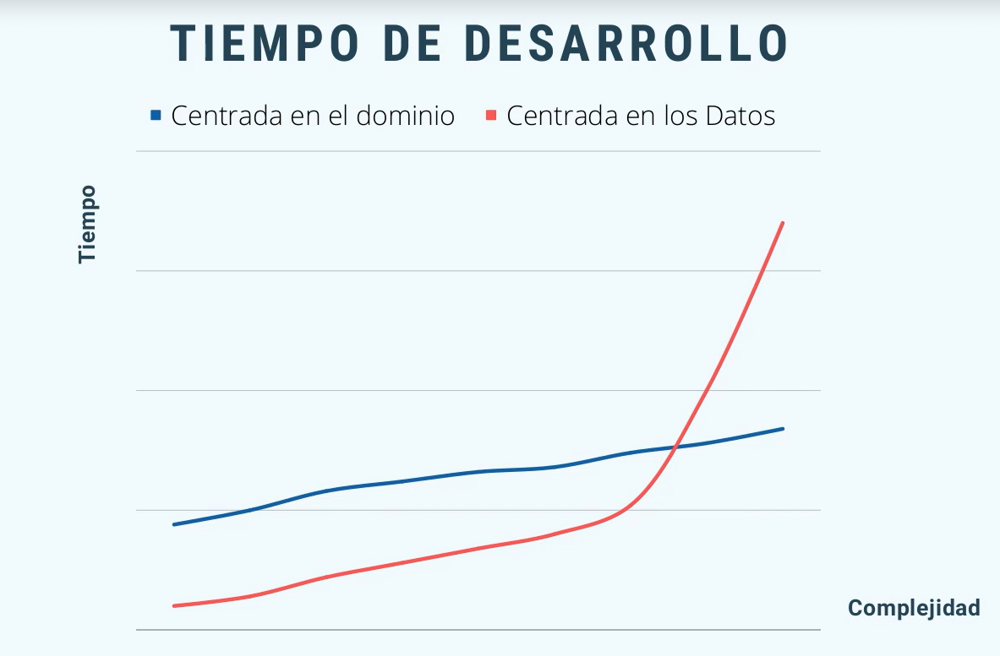
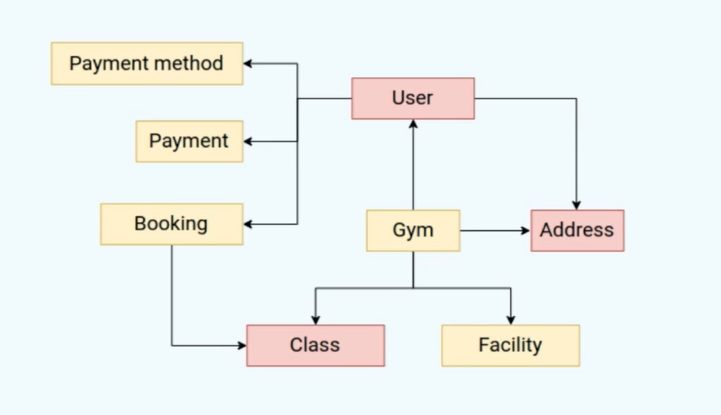
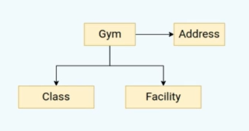
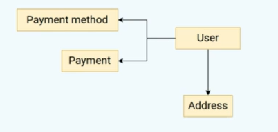
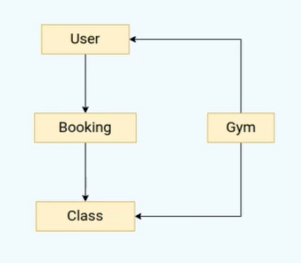
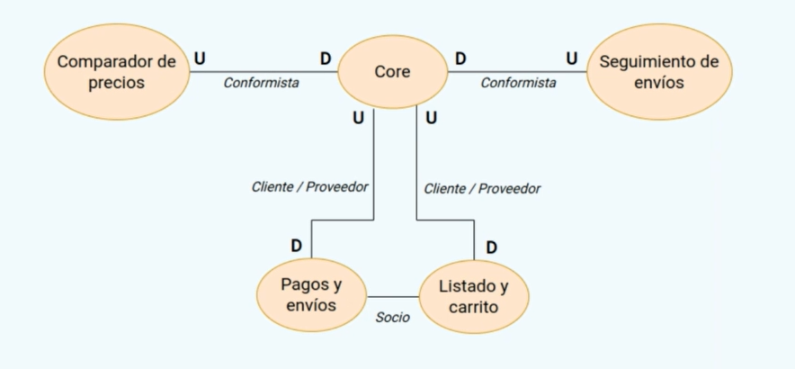

+++
title = 'Domain Driven Design (DDD)'
date = 2023-11-10T11:34:02+01:00
draft = false

ShowBreadCrumbs = true
ShowReadingTime = true
ShowShareButtons = true

tags = ["DDD"]
+++

Empezaremos por ver las diferencias entre una arquitectura centrada en datos y otra en el dominio.

## Arquitactura centrada en los datos ❌

- Se piensa primero en los **datos que se necesitan almacenar**.
- Se recopilan requisitos para tener claras las **reglas de negocio**.
- Diseño del modelo de datos.
- Diseñamos y construimos nuestro sistema para **trabajar con los datos.**
- Como consecuencia, tenemos una **arquitectura de software totalmente dependiente de los datos.**

## Arquitectura centrada en el dominio ✅

- Se piensa en el **dominio del problema** (lógica central es decir enfocarnos en todas las cosas importantes relacionada con el área del problema que queremos tratar) no en los datos que se necesitan almacenar.
- Se modelan todas las **entidades y reglas** especificas del dominio
- A partir de ahí implementar los casos de uso que queremos resolver.

## Contextos acotados

Son un concepto clave en DDD:

- Un contexto acotado es un límite conceptual que define un área especifica de conocimiento/negocio.
- Dentro de un contexto acotado, el lenguaje de dominio y el lenguaje ubicuo son coherentes y alineados.
- Permiten dividir un modelo de dominio grande en partes más manejables.
- Evitan que un modelo de dominio crezca indefinidamente y se vuelva inmanejable.
- Facilitan el desarrollo y evolución independiente de cada área de negocio modelada.

### Problemas que soluciona

Tener distintas personas que trabajan en distintas funcionalidades que interactuan y modifican entidades compartidas:

En este ejemplo la entidad class se está tratando de la misma forma desde el punto de vista del gimnasio que de las reservas y esto es peligroso ya que podemos tener distintos requisitos de información de la clase en función del contexto en el que nos encontremos.

Desde el **punto de vista del gimnasio** nos interesará saber:

- El nombre de la clase
- Los horarios
- Descripción de la clase.
- Duración
- Quien la imparte
- etc

Desde el **punto de vista de la reserva** nos interesa saber:

- El nombre de la clase para tener algo de información de la misma.

Entonces estamos teniendo a distintas personas o equipos compartir la misma entidad clase cuando tienen necesidades totalmente distintas, por lo que se puede dar el caso que las modificaciones que realice un equipo puede afectar de manera indirecta al otro.

Una mejor forma sería dividiendo el problema anterior en 3 de la siguiente forma:

1. Contexto información

2. Contexto pagos

3. Contexto reservas

Ahora no se comparten entre distintos equipos si no que cada uno tiene sus propias entidades en distintos contextos.

Estas entidades que están definidas en diferentes contextos no son duplicidad del código, si no una aclaración del mismo.

Evidentemente estos contextos no son independientes entre sí, se necesita que cada contexto cooperen entre ellos.

## Mapeo de contexto

Es un diagrama en el que se dejan claras la interacciones y dependencias entre los distintos contextos.

**El contexto Upstream (U) condiciona siempre al Downstream (D)**

En caso de no haber ninguna relación significa que ninguno manda sobre el otro.

### Tipos de relaciones (Comunicaciones entre contextos)

- **Conformista (Conformist)** : No existe ninguna capacidad de negociación.
- **Cliente/Proveedor (Customer / Supplier)** : Dependencia con cierto grado de negociación. Necesidades en el cliente pueden implicar cambios en el proveedor.
- **Socio (Partnership)** : Ambos colaboran por una meta en común, por lo que ambos lados de la relación tienen poder para influenciar al otro.
- **Núcleo compartido (Shareed Kernel)** : Dos o más contextos comparten un mismo modelo. Todos necesitan estar de acuerdo para realizar cambio. Difícil de mantener.
- **Capa de anticorrupción** : Interfaz que utiliza el Downstream para interactuar con Upstream, sin importan los cambios realizados en el último.
- **Open Host Service/ Published Language** : Relaciones de tipo **conformista** en las que se provee de documentación al Downstream context. Además se proporcionan **versiones** y compatibilidades entre ellas.
