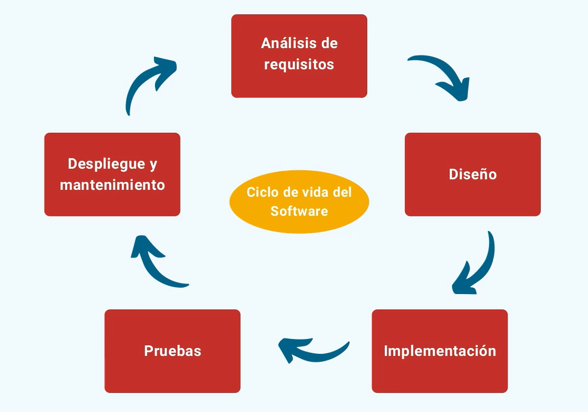
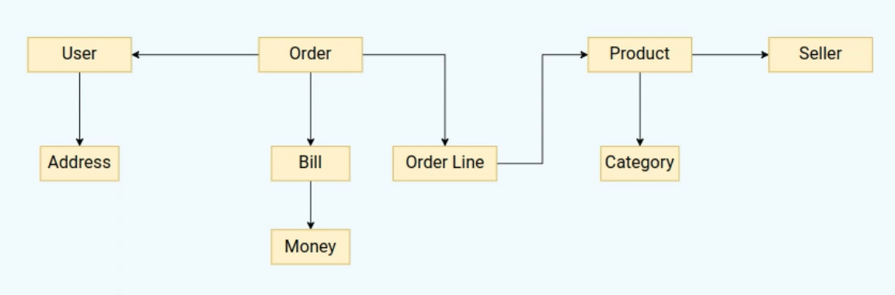
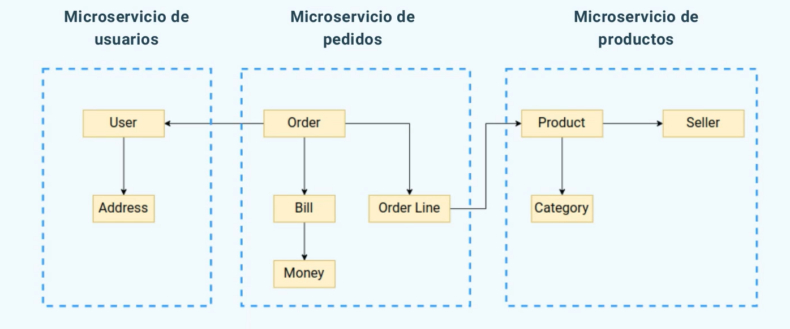
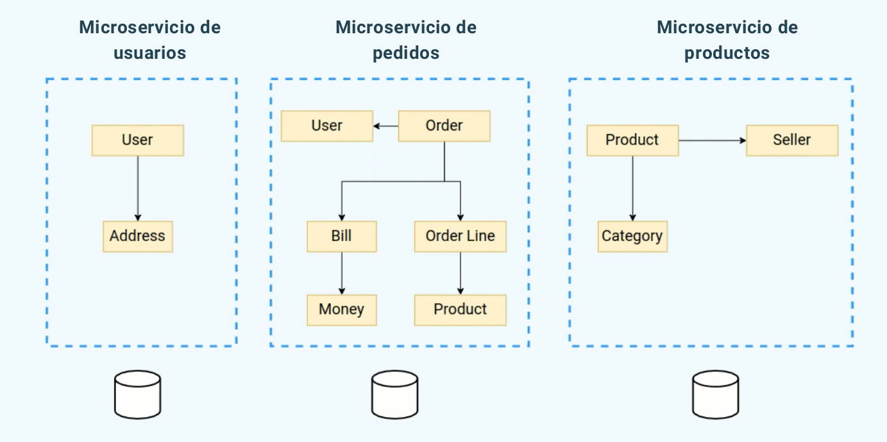
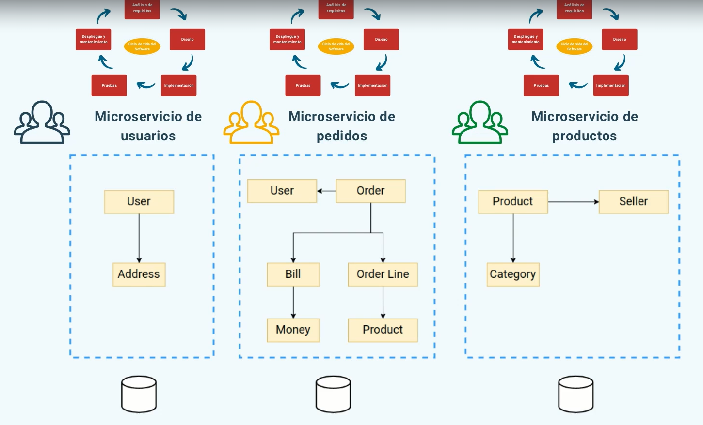
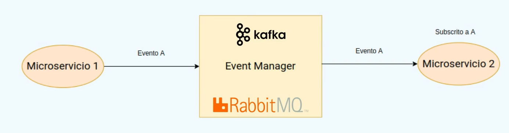

+++
title = 'Introducción microservicios'
date = 2023-12-04T09:00:28+01:00
draft = false
tags = ["microservicios"]

ShowBreadCrumbs = true
ShowReadingTime = true
ShowShareButtons = true
showToc = true
+++
Hoy hablaré de los microservicios, que son, para que sirven y pros y contras.

## ¿Qué son?

La arquitectura de microservicios proporciona una serie de prácticas, organización de trabajo y de equipos para **construir software complejo de forma más eficiente, rápida y a gran escala**. Esto es así debido a que la aplicación es un conjunto de servicios pequeños e independientes en el que cada uno se centra en una tarea específica y se comunica con otros servicios a través de interfaces bien definidas.

### Ciclo de vida del software

Dividimos el sistema en **contextos cerrados**

- Creamos un microservicio para cada contexto.

Micro en microservicios se refiere al alcance de las funcionalidades. No hay estándar para lo grandes que deben ser pero lo que si, es que **deben hacer una cosa y hacerla bien**.

Cada microservicio vivirá de forma independente a los demás.

- Equipo propio.
- Repositorio de código propio.
- Base de datos propia.
- Cada uno elige las tecnologías más apropiadas para su caso.
- Deben ser **desplegadas de forma independiente**.

Ejemplo

Como vemos hay dependecias entre USER y ORDER & ORDER LINE Y PRODUCT cosa que podemos solucionar creando una base de datos para cada uno con los detalles que ellos necesiten quedando de la siguiente forma:

**Esto no es una duplicación de código es un aclaración del mismo.**

Es interesante usar esta arquitectura porque cada contexto cerrado (microservicio) está asignado a un equipo distinto y cada uno con su propio ciclo de vida ayudando a que el sistema sea más escalable y con una respuesta más rápida ante nuevas funcionalidades o problemas.

## Comunicación entre microservicios

Evidentemente para ser un programa funcional es necesaria la interacción entre los microservicios.

- Metodos de comunicación
  - **API Rest:** Simple pero servicios acoplados, ambos tienen que estar disponibles para que la comunicación funcione, suele ser síncrono por defecto.
  - **Sistema de mensajes**. Event Driven Architecture. Ej: Kafka, RabbitMQ, ActiveMQ etc. Desacoplan totalmente los dos servicios, su procesamiento es asíncrono y además si un sistema no está disponible, **el mensaje permanecerá en la cola hasta que vuelva a estar disponible** momento por el cuál sera consumido.
 
---

### Nunca se debe compartir la base de datos

Los microservicios dejan de ser independientes lo que conlleva a que no se puede desarrollar, desplegar ni escalar de forma independiente.

La encapsulación de los datos seria inexistente, por la cuál un microservicio podría modificar información que no le corresponde.
Con BBDD independientes forzamos a realizar la operación a través del microservicio dueño de esos datos.

### Sincronización de los datos

- **Bajo demanda**: Un servicio solicita a otro la información sobre sus entidades cuando le sea necesario. Ej: Pedido solicita la dirección al Usuario al completar el pedido.

Esto no sería lo correcto ya que de nuevo, perderiamos la independencia entre los microservicios.

- **Utilizando sistema de mensajes**: Un microservicio publica un evento cuando sus datos ha sido modificados. El resto de microservicios a los que le interese el evento lo consume y actualiza la información. Ej: Un usuario lanza un evento cuando la dirección se actualiza.

## Seguridad

La seguridad es un tema crítico en una arquitectura como microservicios ya que tenemos más puntos de entrada por los que acceder al sistema y debemos securizarlos.

Existen mecanismos de autenticación centralizada como pueden ser KEYCLOAK o OKTA con ellos podemos realizar la autenticación en un único punto en la gateway y lo único que se comparte entre microservicios es el token de autenticación que tendrá que ser verificado  en cada microservicio.

## Pros y contras

**Pros**

- División del sistema en subsistemas más manejables por lo cuál el código será más fácil de mantener.
- **Indepedencia real entre equipos**. Cada uno es dueño de su microservicio.
- Posibilidad de realizar escalado y **optimización independiente**.
- **Despliegue independiente**. Si falla un microservicio el resto podría seguir funcionando.
- Elección de la **tecnología apropiada para cada microservicio**.

**Contras**

- **Necesaria la cooperación entre distintos equipos** para los puntos en común entre microservicios.
- **Más complejo** en general que una solución monolítica.
  - Necesidad de identificar correctamente los subdominios.
  - Test en las fronteras entre los microservicios.
  - Despliegue del sistema completo.
  - Seguridad.
- **Interfaz de usuario**: Si es única se puede volver un monolito difícil de mantener, y el equipo que la desarrolla puede ser el cuello de botella  si son varias puede haber problemas en la integración un una única UI.

## Cuando usar

- Sistemas grandes y complejos para **subdominios claramente identificables**.
- **Disponibilidad de personal** para asignar al equipo de cada microservicio.
- **Sistemas de alta disponibilidad** en los que necesitemos escalar fácilmente cada pieza.
- Ahorro de costes.

Hasta aquí esta introducción a los microservicios ¡Gracias por leer!.
