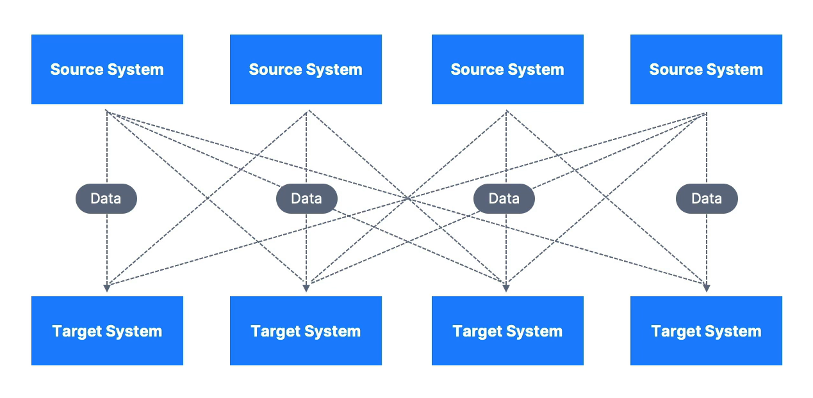
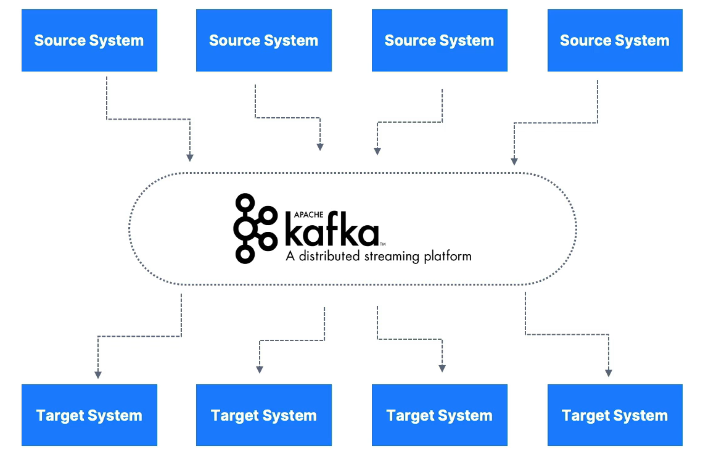

+++
title = '¿Qué es Apache Kafka?'
date = '2023-11-09T09:27:57+01:00'
draft = false
tags = ["Apache kafka"]

[cover]
image = "images/kafka/LogoKafka.png"
alt = "Logo Kafka"
imageWidth = 180
imageHeight = 180

ShowBreadCrumbs = true
ShowReadingTime = true
ShowShareButtons = true
showToc = true
+++

Es una plataforma streaming distribuida que permite a los desarrolladores enviar y recibir mensajes de manera eficiente y confiable a través de aplicaciones. Es escalable, tolerante a fallos y de alto rendimiento lo que lo hace ideal para aplicaciones en tiempo real y procesamiento de datos en grandes volúmenes.

### Sin Kafka

### Con Kafka

## Características

- **Permite** publicar y subscribirse a **flujos de datos** (streams) de manera distribuida.
- **Almacena** flujos de datos de manera **persistente** y tolerante a fallos.
- Procesa streams de datos en **tiempo real**.
- Escala horizontalmente **sin perder rendimiento**.
- Integración con Spark, Flink y otros sistemas de procesamiento de datos.
- API's en Java, Go, Python, .NET, etc.
- Ampliamente adoptado por empresas gigantescas.

## Uso

- Streaming de datos operacionales.
- Pipeline de datos de logs, métricas IoT, etc.
- Integración de sistemas y microservicios.
- Análisis de datos en tiempo real.
- Caché de datos centralizado.

## Ejemplos

1. **Netflix**: Usa Kafka para aplicar recomendaciones en tiempo real mientras ves programas de televisión.
2. **Uber**: recopila datos de taxis y viajes de usuarios en tiempo real, calcula y prevee la demanda además de calcular sus precios en tiempo real.
3. **Linkedln**: Utilza Kafka para evitar el spam, recopilar interacciones de los usuarios para hacer mejores recomendaciones.

En conclusión Kafka se utiliza como mecanismo de transporte, que permite enormes flujos de datos en una empresa.
