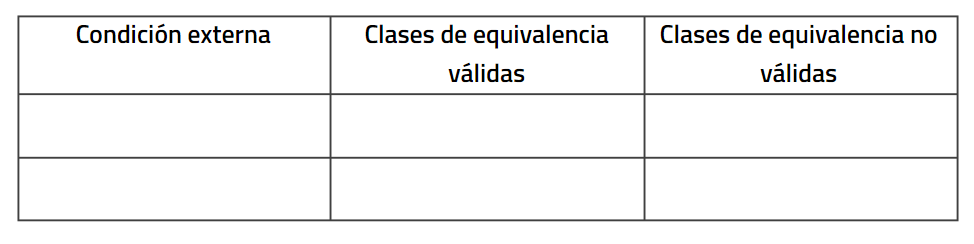
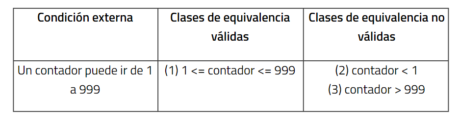
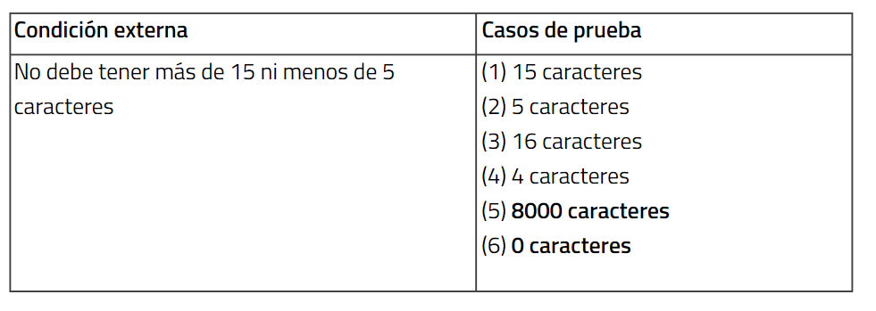
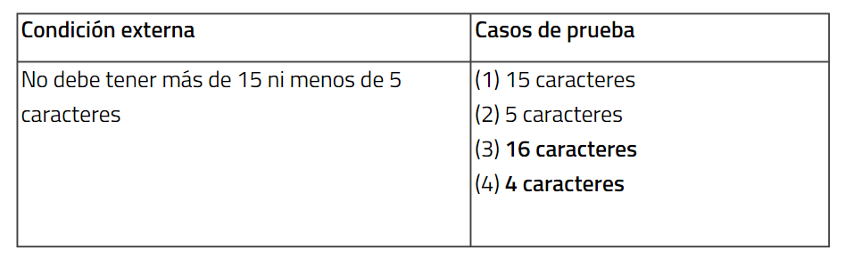

+++
title = 'Técnicas de definición de casos de prueba'
date = 2023-11-28T08:45:37+01:00
draft = false
tags = ["TestUnitarios"]

ShowBreadCrumbs = true
ShowReadingTime = true
ShowShareButtons = true
showToc = true
+++

## Partición de equivalencias

Los **datos de entrada** de un programa **se pueden agrupar en clases** diferentes en las que todos los miembros de dicha clase están relacionados. Cada una de estas clases es una partición de equivalencia en la que **el programa se comporta de la misma forma para cada miembro** de la clase.
Esto nos permite reducir así el número total de casos de prueba que hay que desarrollar. Consta de dos pasos:

### 1. Identificar las clases de equivalencia

Una clase representa un conjunto de estados válidos y no válidos para las condiciones de entrada de un programa. Se representan de la siguiente forma.

Si una condición de entrada especifíca un **rango de valores**, habrá una clase de equivalencia y de clases no válidas. Ej: Si un contador puede ir de 1 a 999.

### 2. Identificar los casos de prueba

Una vez identificadas las clases de equivalencia, para crear los casos hay que seguir una serie de pasos:

- Asignar a cada clase de equivalencia un número único.
- Escribir un caso de prueba que cubra tantas clases válidas posibles. Continuamos creando casos hasta que todas las clases de equivalencia válidas hayan sido cubiertas.
- Escribir un caso de prueba por cada clase de equivalencia no válida hasta que todas las clases de equivalencia válidas hayan sido cubiertas.

#### Análisis de valores múltiples

#### Test de robustez

#### Pruebas de regresión

Estas pruebas **garantizan que los nuevos cambios no tengan efectos secundarios negativos en la funcionalidad existente.**

En futuros posts dejaré ejemplos prácticos sobre los test unitarios.
